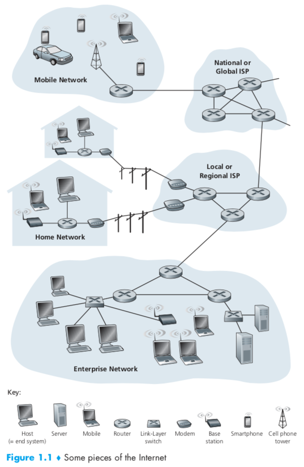
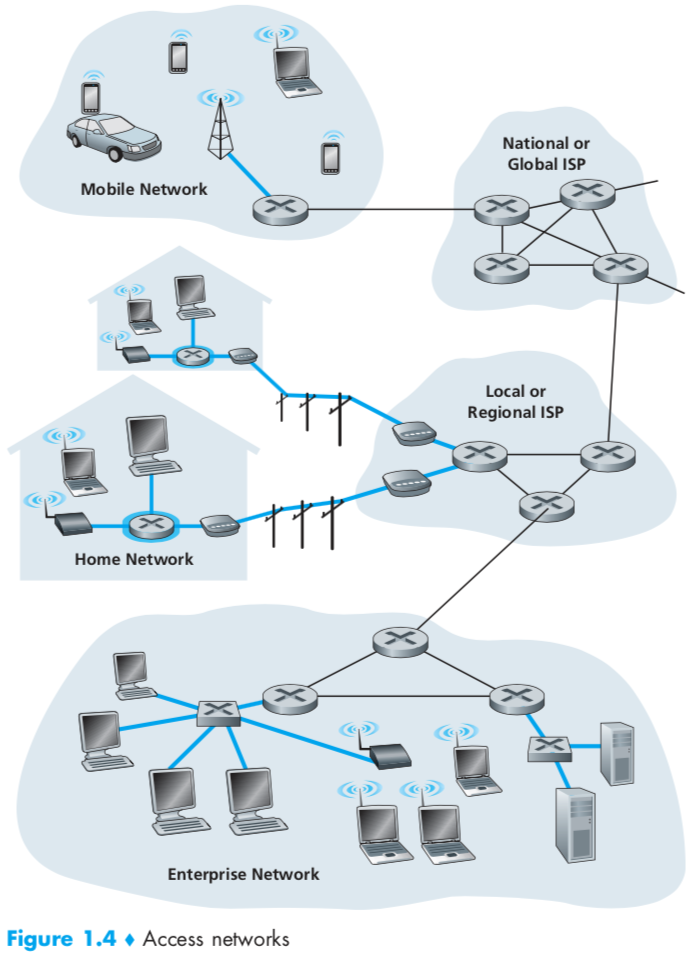
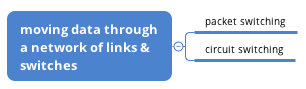
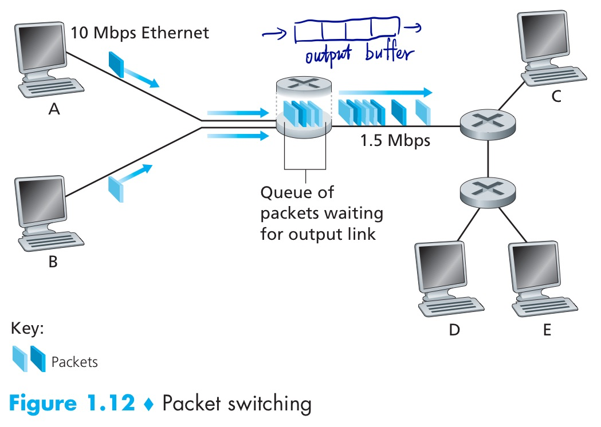
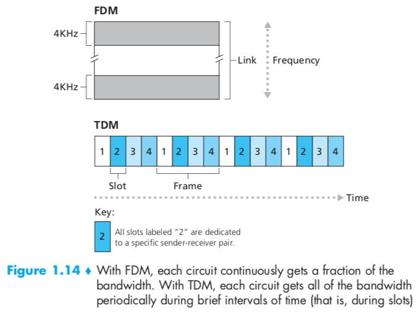

# Ch1 Computer Networks and the Internet

1. What is the Internet
2. The Network Edge
3. The Network Core
4. Delay, Loss, and Throughput in Packet-Switched Networks
5. Protocol Layers and Their Service Models
6. Networks Under Attack
7. History of Computer Networking and the Internet

## 1. What is the Internet?

### 1. A Nuts-and-Bolts Description

hardware and software components.

devices hooked up to the Internet is called **hosts** or **end systems**.

End systems are connected together by a network of **communication links** and **packet switches**.

**transmission rate**: bit/second

The sending end system segments the data and adds header bytes to each segment - **packets**.

packet switch: **routers** and **link-layer switches** - forward packets toward ultimate destinations.

==Link-layer switches are typically used in access networks, while routers are typically used in the network core.==

End systems access the Internet through **Internet Service Providers (ISPs)**.

**Protocols**: control the sending and receiving of information within the Internet.

### 2. A Services Description

Internet is **an infrastructure that provides services to applications.**

How does one program running on one end system instruct the Internet to deliver data to another program running on another end system?

Internet **Application Programming Interface (API)**.

### 3. What is a Protocol?

A protocol defines the format and the order of messages exchanged between two or more communicating entities, as well as the actions taken on the transmission and/or receipt of a message or other event.

## 2. The Network Edge

host = end system = [client, server]

### 1. Access Networks

access network—the network that physically connects an end system to the first router (also known as the “edge router”)

### 2. Physical Media

## 3. The Network Core

### 1. Packet Switching

#### Store-and-Forward Transmission

L: length of packet, R: sending rate, d: delay from end to end
$$
d_{end-to-end}=N\frac{L}{R}
$$

#### Queuing Delays and Packet Loss

#### Forwarding Tables and Routing Protocols

### 2. Circuit Switching

In circuit-switched networks, the resources needed along a path (buffers, link transmission rate) to provide for communication between the end systems are reserved for the duration of the communication session between the end systems.

#### Multiplexing in Circuit-Switched Networks

- frequency-division multiplexing (FDM)
- time-division multiplexing (TDM)

### 3. A Network of Networks

## 4 Delay, Loss, and Throughput in Packet-Switched Networks

#### Overview of Delay in Packet-Switched Networks

- Processing Delay
- Queuing Delay
- Transmission Delay = $L/R, L = packet\ length, R = transmission rate$ 
- Propagation Delay = $d / s,d = distance, s = speed$

$d_{nodal} = d_{proc} + d_{queue} + d_{trans} + d_{prop}$

#### Queuing Delay and Packet Loss

$a$ - the average rate at which packets arrive at the queue (packets/sec)

$La/R$ - **traffic intensity**

#### End-to-End Delay

Traceroute

#### Throughput in Computer Networks

throughput depends on the transmission rates of the links over which the data flows

## 5. Protocol Layers and Their Service Models

### 1. Layered Architecture

- Application
  - HTTP, SMTP, FTP, DNS
  - **message**
- (Presentation)
- (Session)
- Transport
  - TCP, UDP
  - **segment**
- Network
  - IP, routing protocls
  - **datagram**
- Link
  - Ethernet, WiFi, DOCSIS, PPP
  - **frame**
- Physical
  - move the individual bits from one node to the next

### 2. Encapsulation

- header field
- payload field