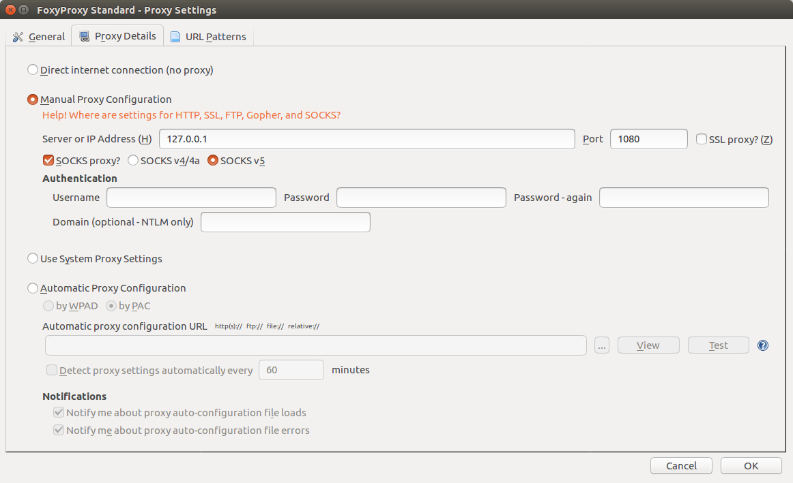

# Ubuntu Software Installation

## CUDA & cuDNN

这个比较简单，按照`CUDA_Installation_Guide_Linux`的指示来就行了。

下载：

1. `cuda-repo-ubuntu1604-8-0-local-ga2_8.0.61-1_amd64.deb`
2. `cudnn-8.0-linux-x64-v6.0.tgz`

```bash
sudo dpkg -i cuda-repo-ubuntu1604-8-0-local-ga2_8.0.61-1_amd64.deb
sudo apt-get update
sudo apt-get install cuda
```

### cuDNN

接着解压`cudnn-8.0-linux-x64-v6.0.tgz`

```bash
tar xvzf cudnn-8.0-linux-x64-v6.0.tgz
sudo cp cuda/include/cudnn.h /usr/local/cuda/include
sudo cp cuda/lib64/libcudnn* /usr/local/cuda/lib64
sudo chmod a+r /usr/local/cuda/include/cudnn.h /usr/local/cuda/lib64/libcudnn*
```

可能需要添加路径（我这里不需要）

```bash
export CUDA_HOME=/usr/local/cuda
export DYLD_LIBRARY_PATH="$DYLD_LIBRARY_PATH:$CUDA_HOME/lib"
export PATH="$CUDA_HOME/bin:$PATH"
```

## OpenCV

从Github上下载

1. opencv
2. opencv_contrib

运行脚本 (可跟据需要添删命令)

```bash
sudo apt-get update
sudo apt-get upgrade
sudo apt-get autoremove

# Build tools:
sudo apt-get install build-essential cmake

# GUI (if you want to use GTK instead of Qt, replace 'qt5-default' with 'libgtkglext1-dev' and remove '-DWITH_QT=ON' option in CMake):
sudo apt-get install qt5-default libvtk6-dev

# Media I/O:
sudo apt-get install zlib1g-dev libjpeg-dev libwebp-dev libpng-dev libtiff5-dev libjasper-dev libopenexr-dev libgdal-dev

# Video I/O:
sudo apt-get install libdc1394-22-dev libavcodec-dev libavformat-dev libswscale-dev libtheora-dev libvorbis-dev libxvidcore-dev libx264-dev yasm libopencore-amrnb-dev libopencore-amrwb-dev libv4l-dev libxine2-dev

# Parallelism and linear algebra libraries:
sudo apt-get install libtbb-dev libeigen3-dev

# Python:
sudo apt-get install python-dev python-tk python-numpy python3-dev python3-tk python3-numpy

# Java:
sudo apt-get install ant default-jdk

# Documentation:
sudo apt-get install doxygen

cd opencv-3.2.0
mkdir build
cd build
PATH_TO_ANACONDA=/home/bfb
cmake -D CMAKE_BUILD_TYPE=RELEASE \
    -D CMAKE_INSTALL_PREFIX=/usr/local \
    -D PYTHON_INCLUDE_DIR=$PATH_TO_ANACONDA/anaconda2/include/python2.7/ \
    -D PYTHON_INCLUDE_DIR2=$PATH_TO_ANACONDA/anaconda2/include/python2.7/ \
    -D PYTHON_LIBRARY=$PATH_TO_ANACONDA/anaconda2/lib/libpython2.7.so \
    -D PYTHON2_LIBRARY=$PATH_TO_ANACONDA/anaconda2/lib/libpython2.7.so \
    -D PYTHON_PACKAGES_PATH=$PATH_TO_ANACONDA/anaconda2/lib/python2.7/site-packages/ \
    -D BUILD_EXAMPLES=OFF \
    -D BUILD_NEW_PYTHON_SUPPORT=ON \
    -D BUILD_opencv_python3=ON \
    -D BUILD_opencv_python2=ON \
    -D BUILD_TIFF=ON \
    -D WITH_OPENGL=ON \
    -D WITH_TBB=ON \
    -D WITH_CUDA=ON \
    -D WITH_QT=ON \
    -D WITH_GDAL=ON \
    -D WITH_XINE=ON \
    -D OPENCV_EXTRA_MODULES_PATH=../../opencv_contrib-3.2.0/modules ..
```

接着

```bash
cd build
make -j8
sudo make install
```

## Tensorflow

### Bazel

```bash
# Install JDK8
sudo apt-get install software-properties-common
sudo add-apt-repository ppa:webupd8team/java
sudo apt-get update
sudo apt-get install oracle-java8-installer
# wait...

# Other dependencies
sudo apt-get install pkg-config zip g++ unzip
```

Download `bazel_0.5.3-linux-x86_64.deb` from Github.

```bash
sudo dpkg -i bazel_0.5.3-linux-x86_64.deb
```

### Dependencies

```bash
# Python 2.7
sudo apt-get install python-numpy swig python-dev python-wheel
# Python 3.x
sudo apt-get install python3-numpy swig python3-dev python3-wheel
```

### Configure & make

```bash
git clone https://github.com/tensorflow/tensorflow.git
cd tensorflow
./configure
# Do not choose VERBS, OpenCL, clang, MPI unless you are for sure!
```

```bash
# No GPU
bazel build -c opt //tensorflow/tools/pip_package:build_pip_package
# With GPU
bazel build -c opt --config=cuda //tensorflow/tools/pip_package:build_pip_package

bazel-bin/tensorflow/tools/pip_package/build_pip_package /tmp/tensorflow_pkg

pip install /tmp/tensorflow_pkg/tensorflow-x.x.x-py2-none-linux_x86_64.whl
```

## FireFox 配置翻墙

下载`FoxyProxy Standard`插件，做如下设置




## Chrome 配置翻墙

1. 用翻墙后的Filefox下载Chrome
2. [Github](https://github.com/FelisCatus/SwitchyOmega/releases)上下载`SwithcyOmega`
3. 从备份文件恢复，或根据[here](https://github.com/FelisCatus/SwitchyOmega/wiki/GFWList)设置

```
https://raw.githubusercontent.com/gfwlist/gfwlist/master/gfwlist.txt
```

## KSnapshot

Ubuntu下最好用的截屏软件？

```bash
sudo apt-get install ksnapshot
```

